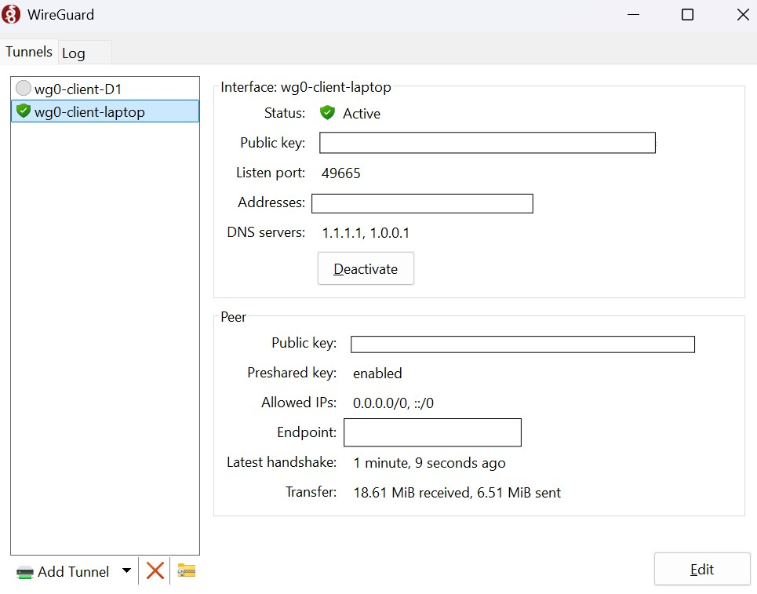

# Personal WireGuard VPN Setup Documentation

## Overview

This documentation outlines the steps I took to **set up a personal WireGuard VPN** server using **Oracle Cloud's Always Free Tier** and how I connected various devices to it. The goal was to enhance my online security and privacy while also learning more about **VPNs**, **networking**, and **self-hosting**.

### Why I Did This

As a student, I wanted to gain hands-on experience in setting up VPNs, specifically a **WireGuard VPN**, because:

* It offers **better privacy** by encrypting internet traffic.
* I get **full control** over my setup and data.
* I wanted to experiment with **self-hosting** and get a deeper understanding of how VPNs work, especially after learning about networking and security concepts.

### What I Used:

* **Cloud provider**: Oracle Cloud Free Tier
* **VPN software**: WireGuard
* **Server OS**: Ubuntu 20.04
* **Tools**: SSH, `systemctl`, `wg-quick`, `iptables`

---

### Here’s what the WireGuard client interface looks like once it’s active, showing the tunnel status and the connection details.

- 

## Steps I Took to Set It Up

### Step 1: Setting Up an Oracle Cloud Account

I started by signing up for an **Oracle Cloud Free Tier** account. This allowed me to access a free **VM instance** with **1 GB of RAM** and **Oracle’s A1 ARM-based CPU**. This was perfect for setting up my **VPN server** without any upfront costs.

1. **Sign up** for Oracle Cloud at [cloud.oracle.com](https://cloud.oracle.com).
2. Activate the **Free Tier**.
3. Create a **VM instance** in a region with **free-tier eligible resources**.

### Step 2: Installing WireGuard on the Server

Once my **VM instance** was running, I connected to it via SSH and installed **WireGuard** on Ubuntu 20.04.

1. SSH into the server:

   ```bash
   ssh ubuntu@your-vm-ip
   ```
2. Update the server’s package list:

   ```bash
   sudo apt update
   sudo apt upgrade
   ```
3. Install WireGuard:

   ```bash
   sudo apt install wireguard
   ```

### Step 3: Setting Up WireGuard Configuration

I created the **WireGuard server configuration file** on the server:

1. Generate the **server’s private and public keys**:

   ```bash
   wg genkey | tee server-private.key | wg pubkey > server-public.key
   ```

2. Set up the WireGuard interface by creating the `wg0.conf` file in `/etc/wireguard/`.

   ```bash
   sudo nano /etc/wireguard/wg0.conf
   ```

   (Filled in server’s private key, peer public key, and other settings based on my specific configuration.)

3. Start WireGuard using the following command:

   ```bash
   sudo wg-quick up wg0
   ```

### Step 4: Creating Client Configurations

I generated a **client configuration** file on my **laptop** (Windows, in my case) to connect securely to the VPN.

1. On the server, I generated the **client's private and public keys**:

   ```bash
   wg genkey | tee client-private.key | wg pubkey > client-public.key
   ```

2. I then edited the **client configuration file** (`wg0-client.conf`), specifying:

   * Client’s private key
   * Server’s public key and endpoint
   * Allowed IPs for routing

3. I transferred the **client configuration** file to my laptop using `scp` or similar tools.

### Step 5: Testing the Connection

I made sure everything was working by testing the connection between the client and the server. I connected using the **WireGuard client** (on Windows) and checked if the VPN connection was up and running.

1. I used `sudo wg` on the server to check the status.
2. On my laptop, I connected to the VPN and verified the new **public IP** by checking whatismyip.com to see if the IP matched the server's IP.

### Step 6: Optional Configuration (Dynamic DNS)

To make my **VPN server accessible from anywhere**, I configured **Dynamic DNS (DDNS)**. This step wasn't required, but it was an added layer of flexibility in case my IP changes.

1. I used a service like **No-IP** to link a domain name to my dynamic IP.
2. Updated my **server configuration** to reflect the DDNS hostname.

---

## Results and What I Learned

Setting up the **WireGuard VPN** on my own server was an eye-opening experience. Not only did I **gain hands-on knowledge** of VPNs and networking, but I also now have complete control over my internet privacy.

1. **Privacy & Security**: My online activities are more private because I control the server, ensuring no one else has access to my data.
2. **Learning**: I now understand the basics of VPN architecture, public/private keys, and server-client communication in VPNs.
3. **Performance**: The VPN performs well, though I would like to optimize the server location for better **latency** depending on where I am connecting from.

---

## Future Improvements

* **Server Location**: I plan to experiment with different regions to see how **latency** and **speed** change.
* **Security**: I’ll add further hardening by configuring **firewalls** and **fail2ban** to protect my VPN server from unauthorized access.
* **Automation**: I'll automate the process of server setup with **scripts** or tools like **Ansible** to make future installations faster.

---

## Conclusion

This project was an amazing learning opportunity, and I'm excited to continue exploring VPNs and **self-hosting**. It allowed me to take control of my online privacy and understand the mechanics behind a **secure internet connection**. If you're interested in learning about **VPNs** and **networking**, setting up WireGuard is a great project to start with!
